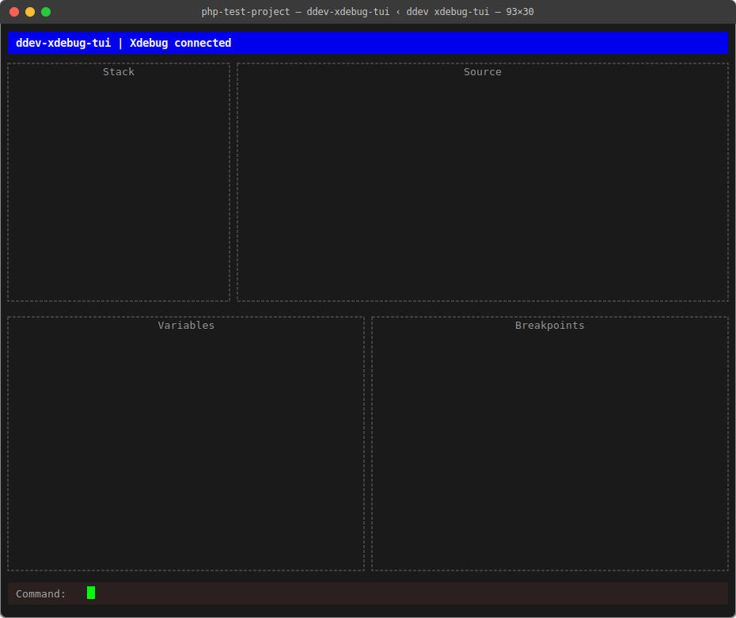
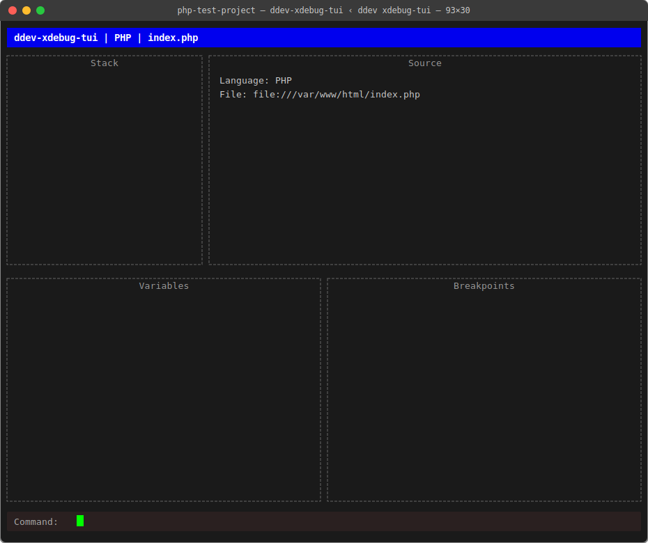

# Handoff - 2026-03-05 - Sprint 2 - claude-sonnet-4-6

## Models Used This Session

| Task | Model |
|------|-------|
| Sprint 2 planning, story authoring | claude-sonnet-4-6 |
| S2-1 TCP listener, S2-2 TUI wiring | claude-haiku-4-5 |
| S2-3 DBGp framing, S2-4 init packet parsing | claude-sonnet-4-6 |
| iso-8859-1 encoding fix | claude-sonnet-4-6 |

## What Was Attempted and Outcome

Sprint 2 completed end-to-end. All four stories done, both demos passed.

- Planned Sprint 2 with two demo checkpoints (Demo A: connection, Demo B: init packet)
- Haiku implemented TCP listener (S2-1) and TUI connection wiring (S2-2)
- Demo A passed: status bar updated to "Xdebug connected" on browser visit

  

- Sonnet implemented DBGp message framing (S2-3) and init packet parsing (S2-4)
- Fixed post-demo: Go's `encoding/xml` rejects `iso-8859-1` declaration from Xdebug — rewrote to UTF-8 before parsing
- Demo B passed: status bar shows `"ddev-xdebug-tui | PHP | index.php"`, Source panel shows language and full file URI

  

## What Worked / What Did Not

**Worked:**
- Two-checkpoint sprint structure was effective — caught the connection issue early before investing in protocol work
- `QueueUpdateDraw` pattern for goroutine-safe TUI updates worked correctly
- DBGp framing implementation (`ReadMessage`) handled length prefix and null terminators correctly on first try
- `bufio.Reader` + `io.ReadFull` approach was clean and correct
- `strings.LastIndex` for extracting filename from URI — no extra imports needed

**Did not work / required fixing:**
- Xdebug sends `encoding="iso-8859-1"` in its XML declaration; Go's `encoding/xml` only handles UTF-8 — fix: `bytes.ReplaceAll` before `xml.Unmarshal`
- `main.go` initially had `defer conn.Close()` inside the `onConnect` callback (from S2-2), which closed the connection before S2-3/S2-4 could read from it — removed in S2-3 prompt

## Current State

- Sprint 2: **complete**
- On Xdebug connect: status bar shows `"ddev-xdebug-tui | PHP | index.php"`
- Source panel shows: `Language: PHP` and full `file:///var/www/html/index.php`
- Connection is held open (not closed after init) — ready for Sprint 3 command sending
- `go build ./...` passes

## Open Questions / Notes for Sprint 3

- **Path mapping:** Xdebug reports container paths (`/var/www/html/...`). The source loader in Sprint 3 will need to map these to host paths (`~/Sites/DDEV/.../testdata/php-test-project/...`). This was flagged in Sprint 1 and deferred — it must be addressed in Sprint 3 when source loading is implemented.
- **Connection lifecycle:** The `conn net.Conn` from `onConnect` is currently held in the goroutine closure in `main.go`. Sprint 3 will need to store it on a session struct so step/breakpoint commands can send to it.
- **DBGp `init` response:** After receiving init, Xdebug is waiting for the first command (typically `run` or `breakpoint_set`). Sprint 3 should send `run` immediately after init if no breakpoints are set, or pause and wait for user input.

## Files Created or Modified

**Created:**
- `.agent-handoff/HANDOFF/handoff-2026-03-05-sprint-2-claude-sonnet-4-6.md` — this file
- `.agent-handoff/SPRINTS/sprint-2.md` — sprint doc (all stories [done])

**Modified:**
- `internal/dbgclient/dbgclient.go` — added `ReadMessage()`, `ParseInit()`, `initPacket` struct; encoding fix
- `internal/tui/tui.go` — added `sourcePanel` field, `SetInitInfo()` method
- `cmd/ddev-xdebug-tui/main.go` — wired init packet read/parse, status bar update, removed premature `conn.Close()`

## References

- `.agent-handoff/AGENT.md` — handoff protocol
- `.agent-handoff/SPRINTS/sprint-2.md` — sprint stories and acceptance criteria
- `.agent-handoff/DOC/implementation-plan.md` — overall 8-phase plan
- `AGENT.md` — project constraints (single session, minimal goroutines, small code)

Last updated: 2026-03-05 by claude-sonnet-4-6
