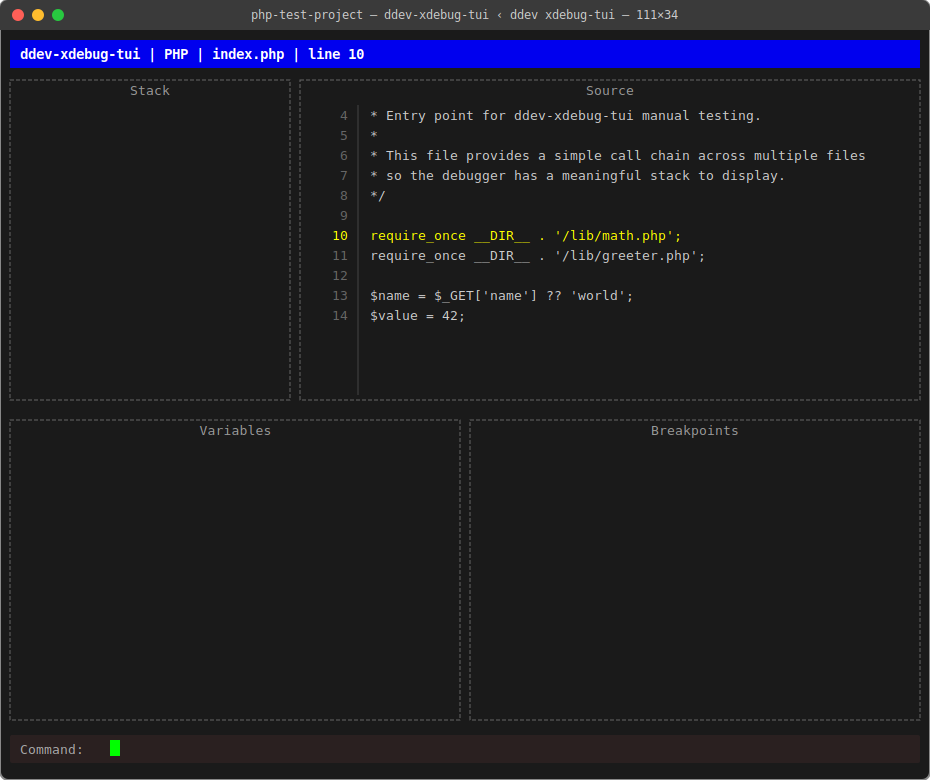
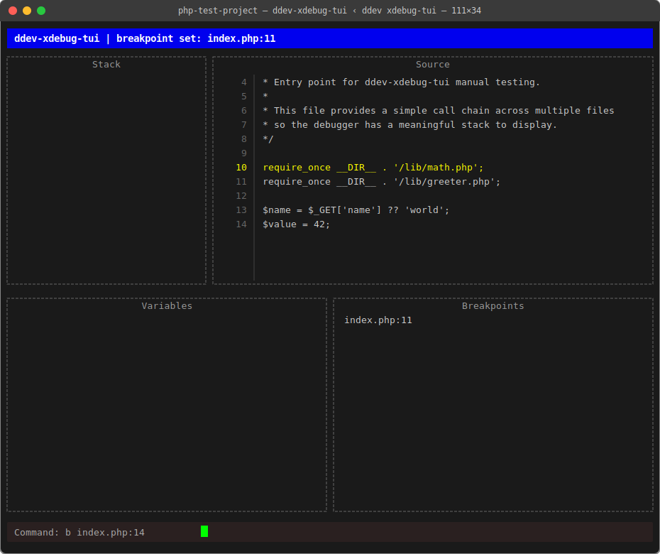

# Sprint 3: Break on Entry, Source Display, Step Commands, Breakpoints

**Sprint Goal:** After visiting the PHP test site in a browser, the TUI
immediately pauses at the first line of PHP, displays the actual source code
with the current line highlighted, and lets the developer step through it and
set breakpoints.

---

## Demo Checkpoints

This sprint has two demo points:

**Demo A — after S3-2:** ✅ PASSED
1. Run `ddev xdebug-tui`
2. Visit `https://php-test-project.ddev.site` in browser
3. TUI pauses at first executable line of `index.php` — status bar shows `"PHP | index.php | line 10"`
   (lines 1–9 are the PHP open tag and a comment block; Xdebug correctly skips to first executable statement)
4. Source panel shows the actual source of `index.php` with line 10 highlighted in black-on-yellow



**Demo B — after S3-4:** ✅ PASSED
1. `ddev xdebug-tui` launches (Xdebug auto-enabled)
2. Type `b index.php:16` — Breakpoints panel shows `index.php:16`
3. Visit `https://php-test-project.ddev.site` — TUI pauses at line 10 (break on entry)
4. Type `r` — PHP runs to the breakpoint; source jumps to line 16, highlighted
5. Shorthand `b 17` also works (infers filename from current file)



---

## Stories

---

### S3-1: Session Struct + Break on Entry
**Status:** [done]
**Owner:** claude-haiku-4-5

**Prerequisites:** Sprint 2 complete (S2-4 done, Demo B passed).

**Description:**
Introduce a `Session` struct in `internal/dbgclient/` to hold the live
connection and any per-session state (current file, current line). After
receiving and parsing the init packet, send `step_into` as the first DBGp
command — this causes Xdebug to pause at the first executable line immediately.
Read the `<response>` back and extract `filename` and `lineno`.

**DBGp command format (sent to Xdebug):**
```
step_into -i 1\0
```
(`-i 1` is the transaction ID; increment per command.)

**DBGp response format (received from Xdebug):**
```xml
<?xml version="1.0" encoding="iso-8859-1"?>
<response xmlns="urn:debugger_protocol_v1"
          command="step_into"
          status="break"
          reason="ok"
          transaction_id="1">
  <xdebug:message xmlns:xdebug="https://xdebug.org/dbgp/xdebug"
                  filename="file:///var/www/html/index.php"
                  lineno="1"/>
</response>
```

**Acceptance Criteria:**
- `Session` struct lives in `internal/dbgclient/` and holds: `conn net.Conn`,
  `txID int` (auto-incremented), `CurrentFile string`, `CurrentLine int`
- `Session.SendCommand(cmd string) error` writes `<cmd> -i <txID>\0` to the connection
- After `ParseInit`, a `Session` is created and `step_into` is sent immediately
- The `<response>` is read back; `filename` and `lineno` are stored on the session
- Status bar updates to: `"ddev-xdebug-tui | PHP | index.php | line 1"`
- Session is passed to `main.go` for use in later stories (via callback or return value)
- `go build ./...` succeeds

**Notes:**
- `SendCommand` must write the null terminator after the command string.
- `txID` starts at 1 and increments on each call.
- The `<response>` after `step_into` must be read with the existing `ReadMessage`
  function — don't block waiting on a bare `Read`.
- Keep the `Session` struct fields exported (`CurrentFile`, `CurrentLine`) so
  the TUI layer can read them without importing internal details.

---

### S3-2: Source Panel + Path Mapping
**Status:** [done]
**Owner:** claude-sonnet-4-6

**Prerequisites:** S3-1 done and compiling.

**Description:**
Load the PHP source file for the current paused location and display it in the
Source panel. This requires mapping the container path Xdebug reports
(`file:///var/www/html/index.php`) to the actual host filesystem path
(`$DDEV_APPROOT/testdata/php-test-project/index.php`).

**Path mapping rules:**
- Strip the `file://` prefix from the URI
- Replace the container root `/var/www/html` with the host project root
- The host project root is `DDEV_APPROOT` directly — DDEV sets this to the project
  root (i.e. the directory containing `.ddev/`), which is already the PHP project root.
  Do NOT append a subdirectory suffix.
- For robustness, also accept a configurable override via a `XDEBUG_TUI_PROJECT_ROOT`
  env var, which if set is used directly instead of `$DDEV_APPROOT`

**Source display:**
- Read the mapped file from disk
- Display it in the Source panel (replacing current placeholder content)
- Prefix each line with its line number: `  1 │ <?php`
- Highlight the current line with a distinct colour (tview supports inline
  colour tags: `[::r]` for reverse video, or `[yellow]` — pick whichever is
  more readable)
- Scroll the Source panel so the current line is visible

**Acceptance Criteria:**
- `internal/source/source.go` (or equivalent) implements path mapping and file loading
- `tui.App` gains a method `SetSource(lines []string, currentLine int)` that
  renders the numbered, highlighted source
- After `step_into` response in S3-1, the Source panel shows the correct file
  with line 1 highlighted
- If the file cannot be found (mapping failed), Source panel shows:
  `"[source not found: <path>]"` — no panic, no crash
- `go build ./...` succeeds

**Notes:**
- tview `TextView` colour tags: use `[black:yellow]text[-:-:-]` for current line
  highlight (reverse video `[::r]` is invisible on dark terminals). Set
  `SetDynamicColors(true)` and `SetRegions(true)` on the TextView.
- The `DDEV_APPROOT` env var is set by DDEV when a host command runs —
  it points to the project root on the host machine.
- Do not load the file on every keypress — only reload when `CurrentFile` changes.

**→ Demo A checkpoint after this story.**

---

### S3-3: Step Commands
**Status:** [done]
**Owner:** claude-haiku-4-5

**Prerequisites:** S3-2 done and Demo A passed.

**Description:**
Wire the input bar to step commands. When the user types one of the following
commands, send the corresponding DBGp command to Xdebug, read the response,
update `CurrentFile`/`CurrentLine` on the session, and refresh the Source panel.

**Command map:**
| Input | DBGp command  | Meaning              |
|-------|---------------|----------------------|
| `s`   | `step_into`   | Step into            |
| `n`   | `step_over`   | Step over            |
| `o`   | `step_out`    | Step out             |
| `r`   | `run`         | Run until breakpoint |

**Response handling:**
- If `status="break"`: update current file/line, refresh source panel
- If `status="stopping"` or `status="stopped"`: show `"[session ended]"` in
  status bar, disable further commands

**Acceptance Criteria:**
- Typing `s` in the input bar sends `step_into`, reads response, updates UI
- Typing `n` sends `step_over`, reads response, updates UI
- Typing `o` sends `step_out`, reads response, updates UI
- Typing `r` sends `run`, reads response, updates UI
- On `status="stopping"` or `status="stopped"`, status bar shows session-ended message
- Source panel and status bar refresh after every step
- Unknown input shows a brief error in the status bar (don't crash)
- `go build ./...` succeeds

**Notes:**
- All UI updates must use `app.QueueUpdateDraw(func() {...})`.
- The input bar should clear after each command is submitted.
- If no session is active (Xdebug not connected), commands should be silently
  ignored or show "not connected" in status bar.

---

### S3-4: Breakpoints
**Status:** [done]
**Owner:** claude-haiku-4-5

**Prerequisites:** S3-3 done and compiling.

**Description:**
Implement breakpoint set and remove commands, maintain an in-memory breakpoint
list, and display it in the Breakpoints panel.

**Input commands:**
- `b index.php:6` — set breakpoint at line 6 of index.php
- `rb index.php:6` — remove breakpoint at line 6 of index.php

**DBGp breakpoint_set command:**
```
breakpoint_set -i <txID> -t line -f file:///var/www/html/index.php -n 6\0
```
(The filename must be mapped back from host path to container path — the reverse
of the S3-2 path mapping.)

**DBGp breakpoint_remove command:**
```
breakpoint_remove -i <txID> -d <breakpoint_id>\0
```
(The `breakpoint_id` is returned in the `<response>` from `breakpoint_set`.)

**In-memory store:**
```go
type Breakpoint struct {
    File string  // host filename, e.g. "index.php"
    Line int
    ID   string  // Xdebug-assigned ID from breakpoint_set response
}
```

**Breakpoints panel:**
Display one line per breakpoint: `index.php:6`

**Acceptance Criteria:**
- `b <file>:<line>` sends `breakpoint_set`, stores returned ID in the breakpoint list
- `rb <file>:<line>` sends `breakpoint_remove` using the stored ID, removes from list
- Breakpoints panel updates immediately after set/remove
- Attempting to remove a breakpoint that doesn't exist shows an error in status bar
- After breakpoints are set, typing `r` runs until the first breakpoint is hit
- `go build ./...` succeeds

**Notes:**
- `breakpoint_set` response contains `id` attribute on the `<response>` element.
- Host-to-container path mapping is the inverse of the S3-2 mapping: replace
  the host project root with `/var/www/html`.
- Only line breakpoints are in scope — no conditional or function breakpoints.

**→ Demo B checkpoint after this story.**

---

## Sprint Review Demo Checklist

**Demo A:**
1. `ddev xdebug-tui` launches (status: "waiting for Xdebug connection")
2. Visit `https://php-test-project.ddev.site` in browser
3. TUI pauses immediately — status bar: `"ddev-xdebug-tui | PHP | index.php | line 1"`
4. Source panel shows `index.php` with line 1 highlighted
5. Type `s` — steps to next line, Source panel updates
6. Press `q` to exit

**Demo B:**
1. `ddev xdebug-tui` launches
2. Type `b index.php:6` (before visiting the site — or after connecting, before `r`)
3. Breakpoints panel shows `index.php:6`
4. Visit the site — TUI pauses at line 1 per break-on-entry
5. Type `r` — PHP runs until the breakpoint; source panel jumps to line 6
6. Press `q` to exit

---

## Decisions Made

- **Break on entry:** Send `step_into` immediately after init (not `run`) so
  execution always pauses at line 1 — no need for an explicit line-1 breakpoint
- **Path mapping:** `DDEV_APPROOT` + `/testdata/php-test-project` → `/var/www/html`;
  override via `XDEBUG_TUI_PROJECT_ROOT` env var
- **Transaction IDs:** Auto-incremented integer starting at 1, managed by `Session`
- **Breakpoint type:** Line breakpoints only (ephemeral, in-memory, no persistence)

---

## Deferred to Later Sprints

- Variable inspection panel (Sprint 4)
- Stack frames panel (Sprint 4)
- Conditional breakpoints (out of scope for PoC)
- Multi-file path mapping beyond the test project layout (Sprint 4)

---

Last updated: 2026-03-05 by claude-sonnet-4-6
