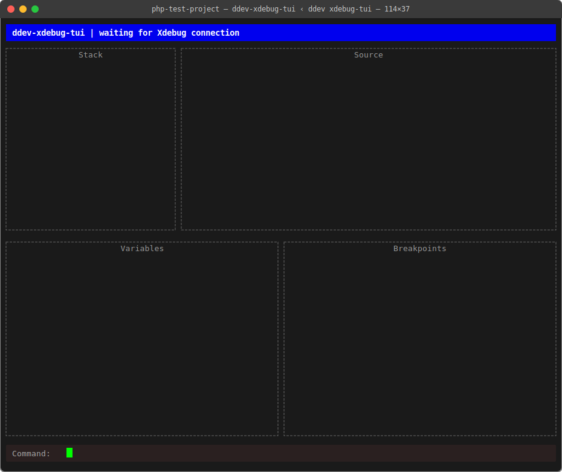

# Sprint 1 Learnings: Go for PHP Developers

This document explains the Go code written in Sprint 1 for developers
who know PHP but are new to Go. Sprint 1 produced the project scaffold,
the TUI shell, and the DDEV add-on stub.

---

## The Go Module System (think: Composer)

In PHP you have `composer.json` to declare your project and its dependencies,
and `composer.lock` to pin exact versions. Go has the same concept split
across two files:

| PHP              | Go           |
|------------------|--------------|
| `composer.json`  | `go.mod`     |
| `composer.lock`  | `go.sum`     |
| `vendor/`        | module cache |

Our `go.mod` looks like this:

```go
module github.com/cellear/ddev-xdebug-tui

go 1.21

require (
    github.com/gdamore/tcell/v2 v2.8.1
    github.com/rivo/tview v0.42.0
)
```

- `module` declares the project's unique import path. Unlike PHP namespaces,
  this is also how other Go code would import your packages. It doesn't have to
  be a real GitHub URL, but convention says it should be.
- `require` lists direct dependencies, just like `require` in `composer.json`.
- Indirect dependencies (things your dependencies need) are listed separately
  with `// indirect` comments.

### What is `go mod tidy`?

`go mod tidy` is the Go equivalent of running `composer install` after someone
changes `composer.json` without running `composer update`. It:

1. Scans all your `.go` files to find what's actually imported
2. Adds any missing dependencies to `go.mod`
3. Removes any dependencies that are no longer used
4. Updates `go.sum` with cryptographic checksums for every dependency

`go.sum` is stricter than `composer.lock` — it contains a hash of every
dependency file so Go can verify nothing has been tampered with. You always
commit `go.sum` to version control.

**The gotcha we hit in Sprint 1:** Haiku (the AI model) invented a fake
dependency version without a real Go environment to check it against. `go mod tidy`
and `go get @latest` are the tools to fix that — they talk to the real package
registry and replace guessed versions with real ones.

---

## Packages (think: PHP namespaces, but tied to directories)

In PHP, a namespace is declared at the top of a file and can be anything:

```php
namespace App\Services\Debug;
```

In Go, the package name is declared at the top of every file, and it must match
the directory name:

```
internal/tui/tui.go       → package tui
internal/session/session.go → package session
cmd/ddev-xdebug-tui/main.go → package main
```

There is one special package name: `main`. A `package main` with a `func main()`
is an executable entry point — like `index.php`, but for compiled binaries.
All other package names are libraries.

To use one package from another, you import by its full module path:

```go
import "github.com/cellear/ddev-xdebug-tui/internal/tui"
```

Then call it as `tui.NewApp()` — similar to how you'd call a static method on
a PHP class from another namespace.

---

## Structs instead of Classes

Go has no classes. Instead it has **structs** — data containers — and functions
that operate on them. Our `App` struct in `tui.go`:

```go
type App struct {
    app *tview.Application
}
```

This is roughly equivalent to:

```php
class App {
    private \tview\Application $app;
}
```

The `*` before `tview.Application` is a **pointer** — more on that below.

Methods are defined separately from the struct, attached using a **receiver**:

```go
func (a *App) Run() error {
    return a.app.Run()
}
```

That `(a *App)` part says "this function belongs to the App struct, and inside
the function, the current instance is called `a`". The PHP equivalent would be:

```php
public function run(): mixed {
    return $this->app->run();
}
```

---

## Pointers — the concept PHP hides from you

PHP handles object references automatically. Go makes you explicit about it.

A **pointer** (`*`) is a variable that holds a memory address rather than a
value. When you write:

```go
type App struct {
    app *tview.Application
}
```

It means `app` holds a reference to a `tview.Application` somewhere in memory,
not a copy of one.

When you see `*` before a type, it means "a pointer to this type."
When you see `&` before a variable, it means "give me the address of this."

For our purposes in Sprint 1, the rule of thumb is simple: **use pointers for
structs you pass around**. If you see `*App` or `*tview.Application`, it just
means "a reference to one of these, not a copy."

---

## Error Handling (no exceptions)

Go has no `try/catch`. Functions that can fail return an error as their last
return value. This is actually a feature — errors are explicit and visible in
the code.

Our `main.go`:

```go
if err := app.Run(); err != nil {
    panic(err)
}
```

This is the Go pattern:
1. Call the function and capture its error return value
2. Check if it's `nil` (Go's equivalent of `null`)
3. If not nil, something went wrong — handle it

`panic` is like PHP's `throw new RuntimeException(...)` — it stops the program.
For a PoC it's fine. In production Go code you'd return the error up the call
stack instead.

The PHP equivalent of this pattern:

```php
try {
    $app->run();
} catch (\Exception $e) {
    throw new \RuntimeException($e->getMessage());
}
```

---

## Variable Declaration: `:=` vs `var`

Go has two ways to declare variables:

```go
// Long form — explicit type
var name string = "world"

// Short form — type inferred from the right side
name := "world"
```

The `:=` (short declaration) is by far the most common. Go infers the type from
whatever is on the right. PHP does this automatically with `$name = "world"` —
Go just requires you to be explicit the *first* time you use a variable (after
that, use `=` not `:=`).

You'll see `:=` constantly in Go code. Don't let it trip you up — it's just
"declare this new variable and set it."

---

## The tview Library

`tview` is the library powering the TUI (terminal user interface). It works
somewhat like a simple HTML layout engine, but for terminals.

The building blocks:

| tview primitive   | HTML/CSS rough equivalent         |
|-------------------|-----------------------------------|
| `tview.Grid`      | CSS Grid                          |
| `tview.Flex`      | CSS Flexbox                       |
| `tview.TextView`  | `<div>` with text content         |
| `tview.InputField`| `<input type="text">`             |

Our layout uses a `Grid` to divide the screen into rows, then `Flex` containers
within those rows to split left/right panels. The grid rows are sized like this:

```go
grid.SetRows(1, 0, 0, 1)
// row 0: 1 line tall  (status bar)
// row 1: flexible     (Stack + Source panels)
// row 2: flexible     (Variables + Breakpoints panels)
// row 3: 1 line tall  (command input)
```

`0` means "take up remaining space equally." `1` means exactly one terminal row.

### Key bindings

tview captures keyboard input at the application level:

```go
app.SetInputCapture(func(event *tcell.EventKey) *tcell.EventKey {
    if event.Rune() == 'q' {
        app.Stop()
        return nil
    }
    return event
})
```

`SetInputCapture` is a callback — a function you pass to another function to be
called later. In PHP terms it's a closure passed as an argument. When `q` is
pressed, we stop the app and return `nil` (meaning "I handled this event, don't
pass it further"). For any other key, we return the event unchanged.

---

## The DDEV Add-on Structure

A DDEV add-on is a directory with:

- `install.yaml` — tells `ddev add-on get` what files to install
- `commands/host/<name>` — shell scripts that become `ddev <name>` commands

The key thing we learned the hard way: `project_files` in `install.yaml` are
copied *into* the target project's `.ddev/` directory. So a file at
`commands/host/xdebug-tui` in the add-on repo lands at
`.ddev/commands/host/xdebug-tui` in the project. If you write
`.ddev/commands/host/xdebug-tui` in `project_files`, you get a double `.ddev/`
and the command isn't found.

The `#ddev-generated` comment at the top of command scripts tells DDEV it's safe
to overwrite the file on reinstall. Without it, DDEV refuses to replace the file
— which would make iterative development painful.

**The rename from `debug` to `xdebug-tui`:** DDEV has a built-in alias called
`debug` (it's shorthand for `ddev utility`). Custom commands with the same name
as built-ins are silently shadowed. When in doubt, check `ddev --help` before
naming a new command.

---

## What We Built

At the end of Sprint 1, running `ddev xdebug-tui` from a DDEV PHP project
launches a full-screen terminal UI with:

- A blue status bar: "ddev-xdebug-tui | waiting for Xdebug connection"
- Four panels: Stack, Source, Variables, Breakpoints
- A command input line at the bottom
- `q` to quit

No debugger logic yet — just the shell. Sprint 2 adds the TCP listener that
Xdebug will connect to.


