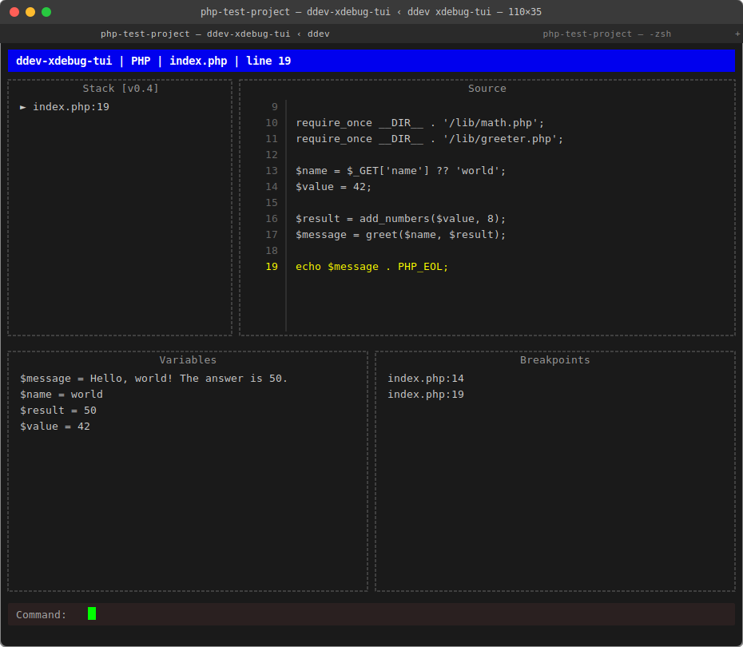

# ddev-xdebug-tui

A small, terminal-native debugger for PHP projects running in **DDEV**.

`ddev-xdebug-tui` lets you debug Drupal, Backdrop, WordPress, and other PHP applications **without installing a full IDE**. It provides a simple terminal interface for stepping through code, inspecting variables, and managing breakpoints.



This tool is intentionally minimal.

It focuses on the debugging features developers use most often, while remaining small, readable, and easy to understand.

---

# Why This Exists

Xdebug debugging is usually done through large IDE integrations such as:

- PhpStorm
- VS Code
- Vim plugins

These tools are powerful but can feel heavy when you just want to:

- set a breakpoint
- step through code
- inspect variables

`ddev-xdebug-tui` provides a lightweight alternative for developers who prefer **terminal workflows**.

---

# Features

Current PoC capabilities:

- terminal UI debugger
- line breakpoints
- step in / step over / step out / continue
- view call stack
- inspect variables
- view source around current execution point
- works with **DDEV projects**

The debugger attaches to the **first incoming Xdebug session**.

Breakpoints are **ephemeral per run**.

---

# Installation

**Step 1 — Install the binary** (requires Go):

```
git clone https://github.com/cellear/ddev-xdebug-tui.git
cd ddev-xdebug-tui
make install
```

This builds and copies `ddev-xdebug-tui` to `~/go/bin/`. Ensure `~/go/bin` is in your `PATH`.

**Step 2 — Install the DDEV add-on** (from your DDEV project directory):

```
ddev add-on get cellear/ddev-xdebug-tui
```

This installs the `ddev xdebug-tui` command.

---

# Usage

From your DDEV project directory:

```
ddev xdebug-tui
```

Xdebug is enabled automatically on start and disabled when you quit.

Then trigger a request in your browser or with `curl`.

The debugger will pause at your first breakpoint (or at the first executable line on entry).

---

# Commands

```
s  step into
n  step over
o  step out
r  run (continue to next breakpoint or end)
q  quit
```

Breakpoint commands:

```
b file.php:45
rb file.php:45
```

---

# Philosophy

This project deliberately avoids becoming a full-featured Xdebug client.

Goals:

- small codebase
- easy to understand
- easy to run
- minimal configuration
- CLI-first workflow

If you need advanced debugging features such as:

- conditional breakpoints
- watch expressions
- multiple concurrent sessions

you should use a full IDE debugger.

---

# Project Status

Early Proof of Concept.

The current goal is a stable terminal debugger for basic stepping and variable inspection.

---

# Contributing

Contributions are welcome, but please keep the project philosophy in mind:

- avoid unnecessary complexity
- keep the code understandable
- prefer simple implementations

See:

```
AGENT.md
REPO_BOOTSTRAP.md
```

for implementation guidance.

---

# License

MIT
